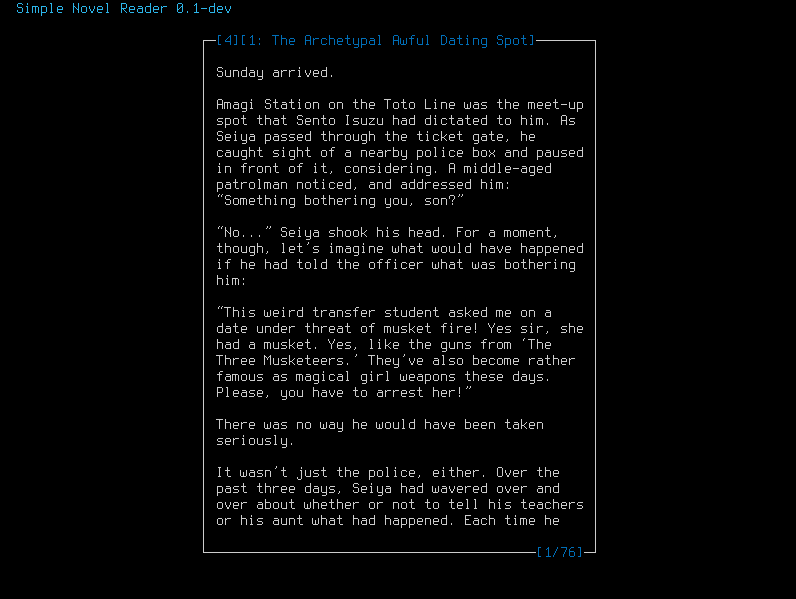

# Simple Novel Reader

CLI light novel reader written in Python for Linux.

## Dependencies:
* BeautifulSoup4
* lxml

## Setup/Usage:
To install:
```bash
pip3 install simple-novel-reader
```
To run program:
```bash
snr \path\to\epub\file
```
On the first run you need to specify a file, next time the file will be opened as default.

## Features:
* save reading progress and quickmarks of a book upon exit,
* starting program without argument will open last read book,
* quickmarks,
* bookmarks,
* colored dialogs,
* dual page view.

## Todo:
* Features:
  + [done] configurable colors from config.ini,
  + [done] bookmarks,
  + [done] dual page view,
  + [done] speed reading view (the same as in koreader perception expander).
* Chores:
  + refactor and clean up code,
  + add comments
  + error handling.

## Screenshots:

