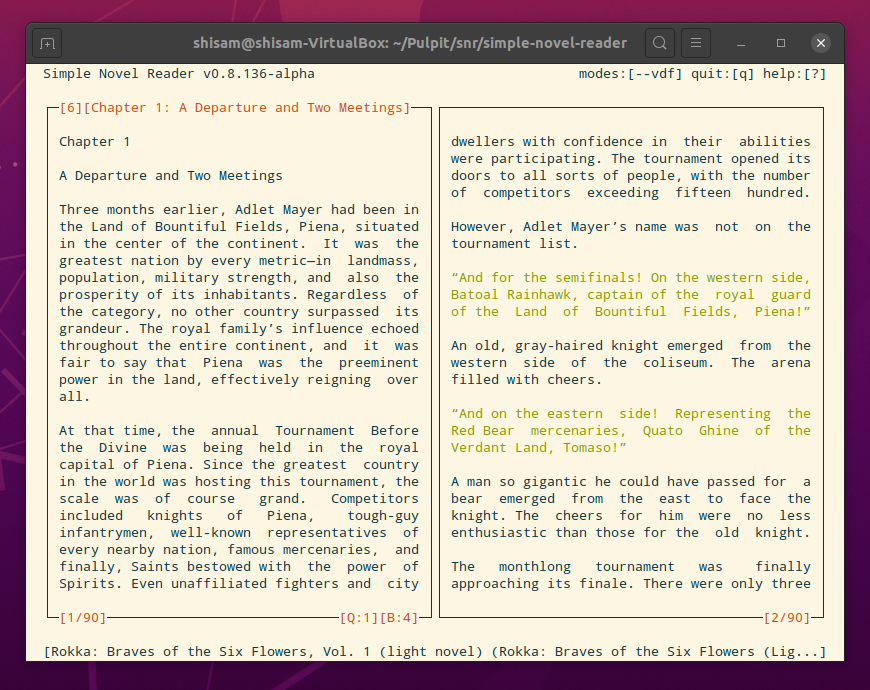

[](https://github.com/gzygmanski/simple-novel-reader/blob/master/LICENSE)
[](https://badge.fury.io/py/simple-novel-reader)
[](https://pepy.tech/project/simple-novel-reader)

CLI light novel reader written in Python for Linux.

## Dependencies:
* BeautifulSoup4
* lxml

## Setup/Usage:
To install:
```bash
pip3 install simple-novel-reader
```
To run program:
```bash
snr \path\to\epub\file
```
On the first run you need to specify a file, next time the file will be opened as default.

## Features:
* save reading progress and quickmarks of a book upon exit,
* starting program without argument will open last read book,
* quickmarks,
* bookmarks,
* colored dialogs,
* dual page view.

## Todo:
* Fixes:
  + correct typos,
  + update help page (forgot to add bookmark key binds),
  + change edit template for new bookmark,
  + change default editor (if $EDITOR is not set) if needed.
* Chores:
  + refactor and clean up code,
  + add comments
  + error handling.

## Screenshots:
<p align="center">
  
</p>
